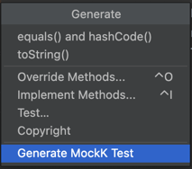
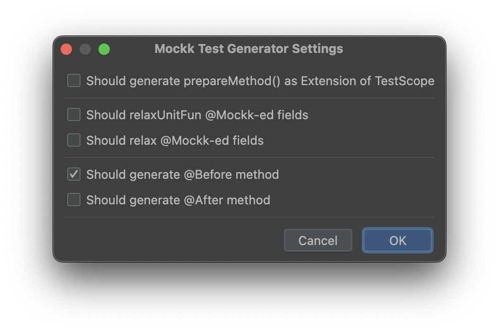
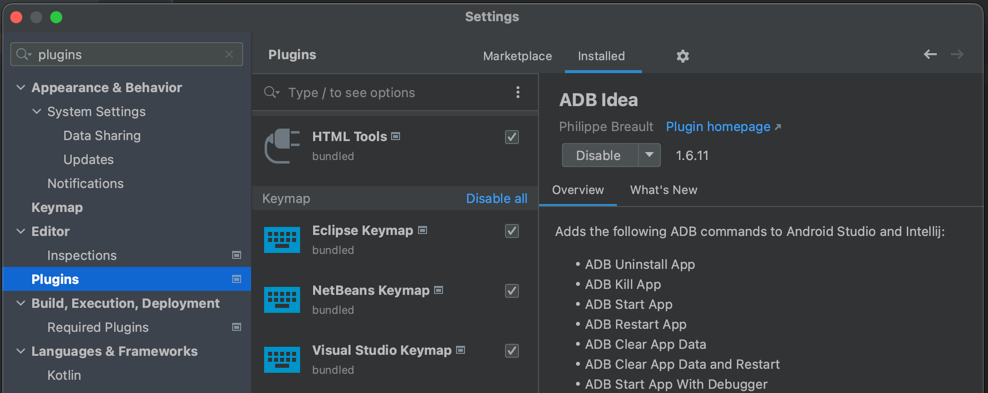
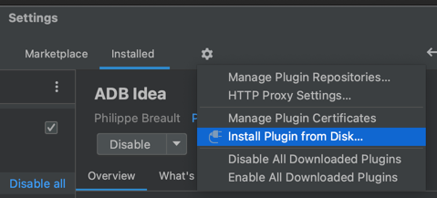

# IDEA Plugin that generates boilerplate code for [Mockk](https://github.com/mockk/mockk) tests.

---

## Description:

---

<details>
<summary>Plugin take class as an input:</summary>

```kotlin
package com.test.project

class Foo(
    val t1: Any,
    val t2: (Any) -> Unit,
    val t3: kotlin.Lazy<Any>,
    val t4: dagger.Lazy<Any>,
)
```

</details>

<details>
<summary>And generates test class with some boilerplate code as output:</summary>

```kotlin
package com.test.project

import io.mockk.impl.annotations.MockK

class FooTest {

    @MockK
    lateinit var t1: Any

    @MockK
    lateinit var t2: (Any) -> Unit

    @MockK
    lateinit var t3: Any

    @MockK
    lateinit var t4: Any

    private fun prepareFoo(
        t1: Any = this.t1,
        t2: (Any) -> Unit = this.t2,
        t3: Any = this.t3,
        t4: Any = this.t4,
    ): Foo {
        return Foo(
            t1 = t1,
            t2 = t2,
            t3 = lazyOf(t3),
            t4 = { t4 },
        )
    }

}

```

</details>

## How To Use

---

Plugin is a part of **Generate** group - open it with next shortcuts and select **Generate MockK Test**:

MacOS: <kbd>Cmd</kbd> + <kbd>N</kbd>

Windows: <kbd>Alt</kbd> + <kbd>Insert</kbd>



You will see next dialog:



|   | Option                                                    | Description                                                        |
|---|-----------------------------------------------------------|--------------------------------------------------------------------|
| 1 | Should generate prepareMethod() as Extension of TestScope | Create method as Ext of TestScope                                  |
| 2 | Should relaxUnitFun @Mockk-ed fields                      | Will add relaxUnitFun to every @Mockk field                        |
| 3 | Should relax @Mockk-ed fields                             | Will add relax to every @Mockk field                               |
| 4 | Should generate @Before method                            | Will generate @Before method and mock annotated with @MockK fields |
| 5 | Should generate @After method                             | Will generate @After method and un-mock everything                 |

## How To Install

---

- Download `mockk-test-generator-VERSION.zip` from Releases section


- Open **Plugins** settings screen



- Select **Install Plugin from Disk...**



- Select `mockk-test-generator-VERSION.zip` file.
- Restart IDE if needed.